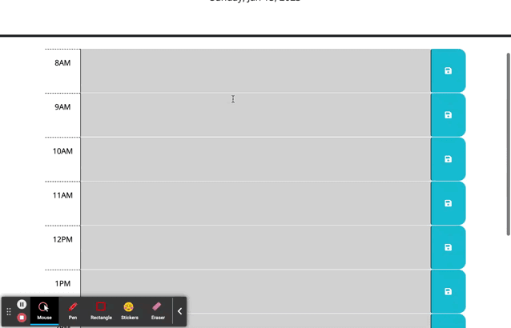

# 05 Third-Party APIs: Work Day Scheduler

## Your Task

Our task was to complete a simple work day calendar where we can add an event for the hour that will persist even if the page is refreshed. 

Link to deployed site: https://mariahw4.github.io/05-workday-scheduler/

The following animation demonstrates the application functionality:




## User Story (from source)

```md
AS AN employee with a busy schedule
I WANT to add important events to a daily planner
SO THAT I can manage my time effectively
```

## Acceptance Criteria (from source)

```md
GIVEN I am using a daily planner to create a schedule
WHEN I open the planner
THEN the current day is displayed at the top of the calendar
WHEN I scroll down
THEN I am presented with timeblocks for standard business hours
WHEN I view the timeblocks for that day
THEN each timeblock is color coded to indicate whether it is in the past, present, or future
WHEN I click into a timeblock
THEN I can enter an event
WHEN I click the save button for that timeblock
THEN the text for that event is saved in local storage
WHEN I refresh the page
THEN the saved events persist
```


made by: Mariah Wear - due Jan 18th, 2023
© 2022 edX Boot Camps LLC. Confidential and Proprietary. All Rights Reserved.
